# depth-estimation-paper-note

## 各任务评价标准

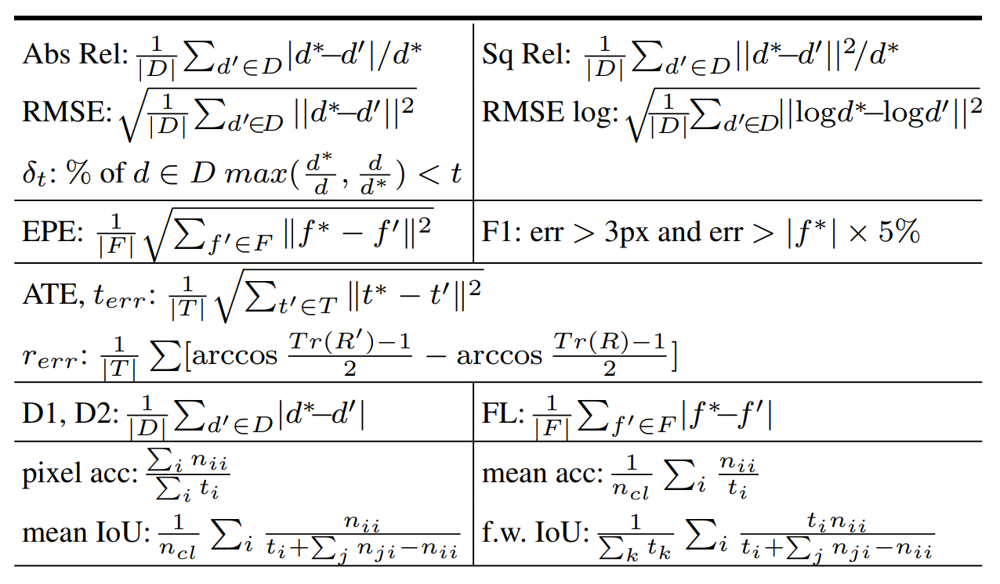

## Benchmark

- Depth Evaluation

  |      | Abs Rel | Sq Rel | RMSE | RMSE Log |$\delta_{t} < 1.25$      | $\delta_{t} < 1.25$ | $\delta_{t} < 1.25$ |
  | ---- | :-----: | :----: | :--: | :------: | :--: | :--: | ---- |
  |      |         |        |      |          |      |      |      |
  |      |         |        |      |          |      |      |      |
  |      |         |        |      |          |      |      |      |
  |      |         |        |      |          |      |      |      |

- Disparity Evaluation

- Flow Evaluation

- Pose Evaluation

## 1. Monocular + Self-supervised

### （1）Semantically-Guided Reprensentation learning for self-Supervised monocular depth

本篇论文是TRI发的一篇结合语义分割和单目深度估计的文章。

这篇文章主要有两个创新点：1. 在单目深度估计的训练网络架构中，添加了语义分割的信息，作为引导；2.提出了一个2-stage的训练方法

对于第一点改进，该文与以往不同的创新点是，该文使用的语义分割网络，在训练过程中，参数不会进行更新，并且使用了一个pixel-adaptive convolution，对语义信息的学习进行指导。文中提到的使用pa convolution的原因是因为卷积操作具有平移不变性，所以说卷积核参数其实是和图像内容无关的，但是添加语义信息就是希望针对不同像素学习到不同的信息。

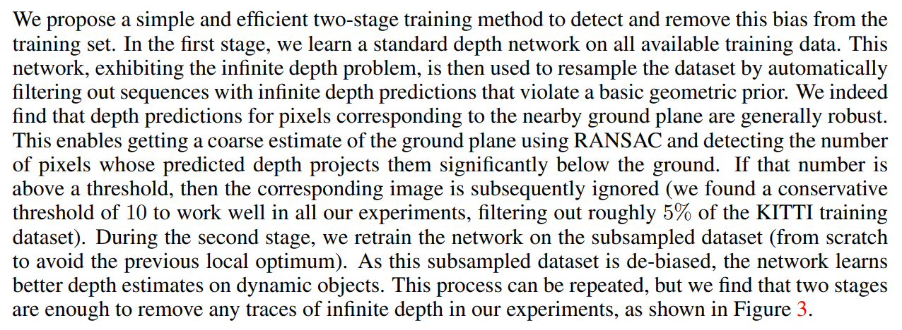

第二点改进是提出了一个两阶段的训练策略，该点主要针对的是保持相对运动的物体在单目深度估计中会呈现出无穷远的特点。解决的方案较为简单，首先使用全部数据进行一次训练。然后对训练集进行预测得到结果。然后，基于地面会一直保持平坦的假设，使用Ransac算法，记录相对地面深度异常的连续点，当数量超过一定阈值后，在第二阶段训练中便放弃该图片不在进行训练。

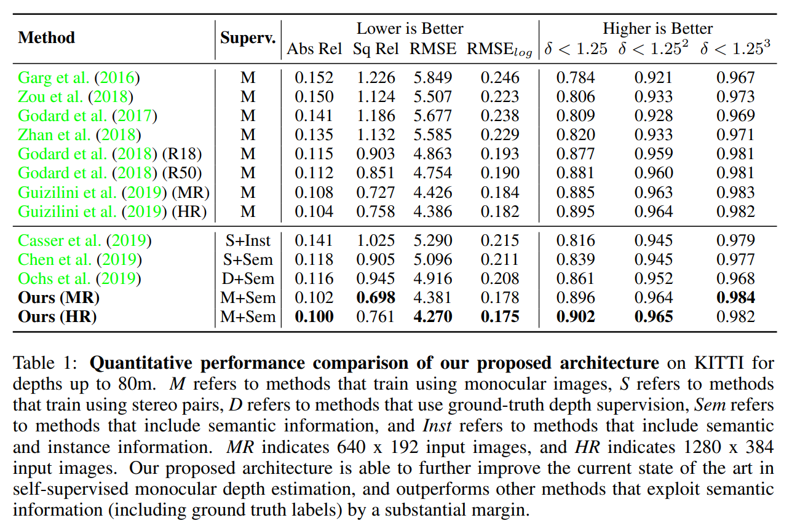

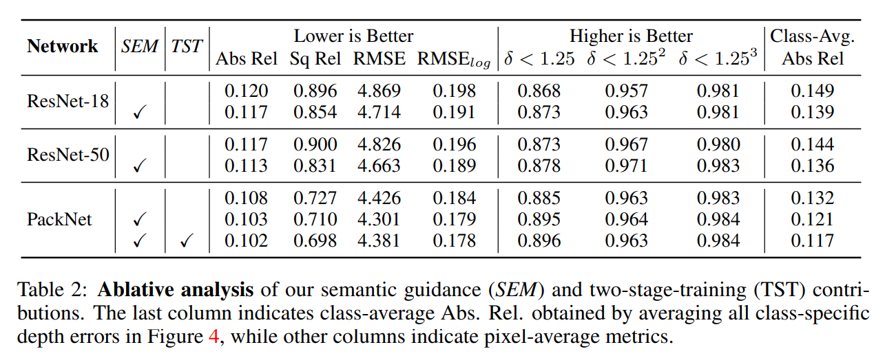

### (2) 3D Packing for Self-Supervised Monocular Depth Estimation

## 2. Monocular + Supervised

## 3. Binocular + Self-supervised

### （1）flow2stereo

论文标题是Flow2Stereo: Effective Self-Supervised Learning of Optical Flow and Stereo Matching 

 

## 4. Binocular + Supervised

### (1)Group-wise Correlation Stereo Network(GwcNet)

结合了目前的两种代价聚合的方法

correlation-based

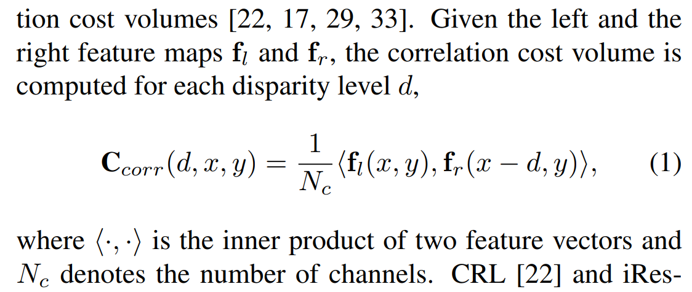

concatenation-based

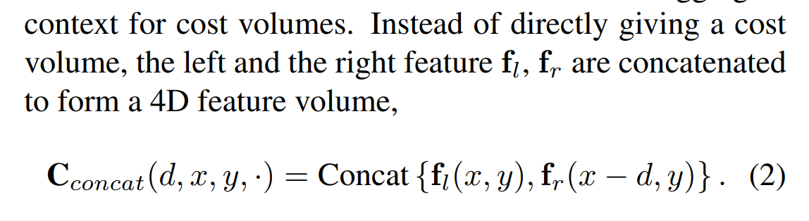

作者在论文中指出， 使用correlation-based的方法进行代价聚合，由于最后对于不同的视差d只会生成单通道的特征图，这样虽然比较efficient，但是丢失了太多的信息；而对于concatenation-based的方法，由于生成的volume里面并不包括特征相似性的信息，所以需要在aggregation的部分从头开始学习相似性的评价，因此需要更多的参数，导致效率不高。

因此作者提出了，基于分组思想的Group-wise correlation network。

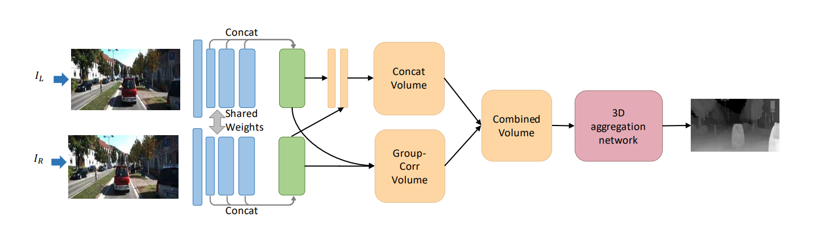

其中，group-wise correlation的思想如下：                                                   

这样就相当于给出了$N_{g}$个代价体。作者认为这种方式能够在给出特征相似性的同时，保留更多的信息。同时作者还指出，该文所提出的方法能够与concatenation volume同时使用。

### (2)GC-Net

论文名称为End-to-End Learning of Geometry and Context for Deep Stereo Regression

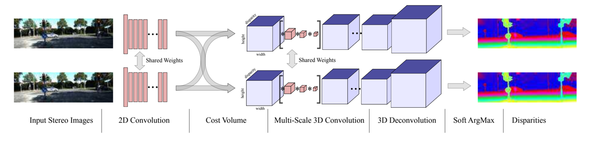

这篇论文首次提出了concatenation-based的cost volume组建方式，而不同于以往DispNetC中那样所使用的例如带有点积操作的correlation-based的组建方式，作者认为这样能够更大程度的学习应用到原始图像的语义信息，但与此同时也增加了参数量。

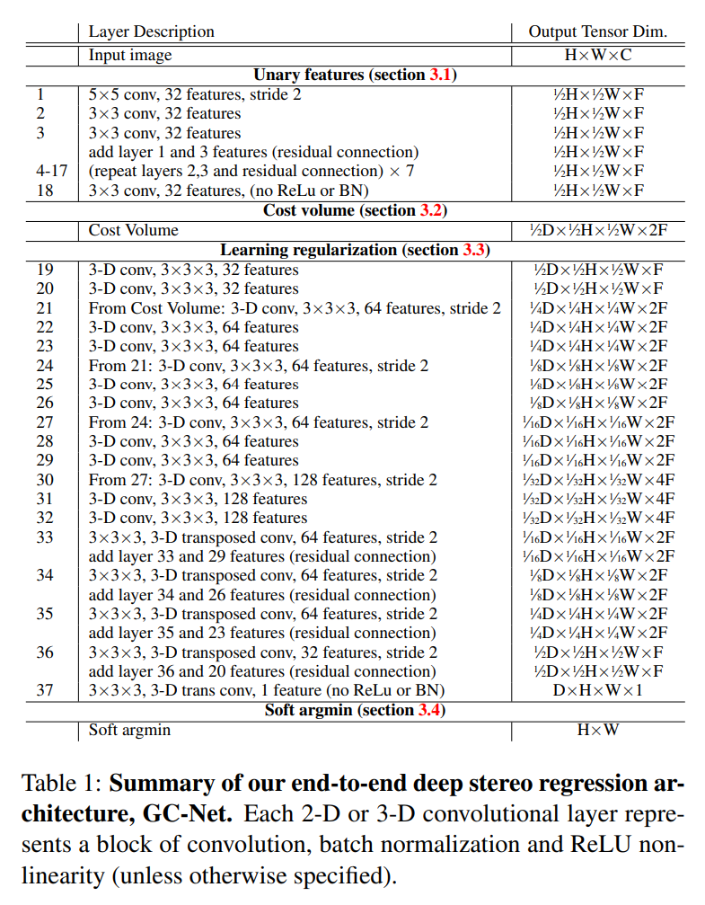

文中提出使用3D卷积对组成代价体进行refine，能够极大的提高双目匹配的性能。作者在这个阶段同样使用了一个encoder-decoder的结构。

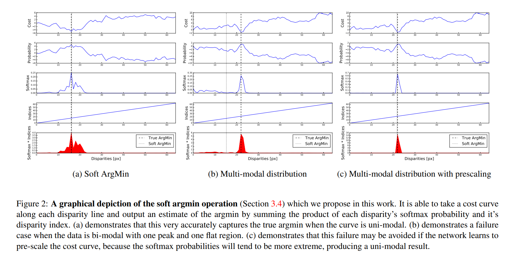

得到大小为**（）**的特征图后，文章接下来提出了可微的soft argmin操作。

**公式**

**这里有一个问题还没有完全弄明白，该网络是如何通过去除unary features最后的一个BN层，实现对multi-modal效应的抑制的？？？**

模型提出的要使用的损失就是L1损失。

**公式**

上图是GC-Ne最后的实验结果。

### (3)AANet

### (4)Hierarchical Deep Stereo Matching on High-resolution Images

该文中，作者提出需要增加双目匹配的精度可以从增大输入图片的分辨率，也即增大f，的角度来解决问题。

视差误差与深度误差的关系：

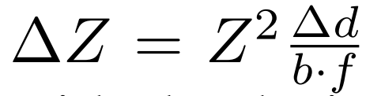

fig. 2，fig. 3是作者所提出来的网络结构，整体来说网络结构没有特别的地方。使用了一个SPP的模块起到加速下采样的作用，采取一个可以再不同阶段输出匹配结果的策略，不同的stage有着不同的速度于精度。在粗看代码时发现了一个细节，应该是为了使模型不要过于大，作者并没有使用concat的cost volume组建方式，而是使用了向量相减的方式进行代价体的构建。

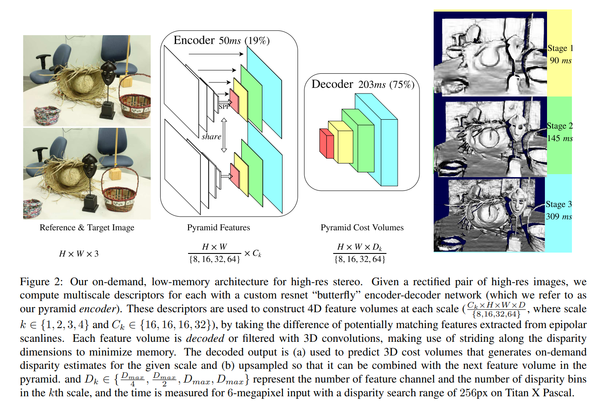

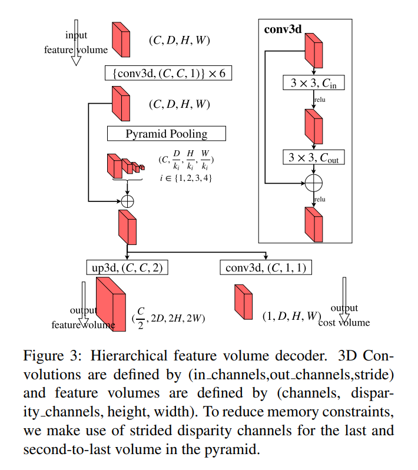

同时，作者针对高分辨率训练的数据增广方式进行了创新，提出了3点有用的数据增广方式：

（1）对于标定误差，使用标定的误差矩阵对图像进行warp操作，进行数据增广，使得模型能够在一定程度上能对标定误差更加鲁棒；

（2）提出对双目匹配的左右两目图片都进行不同的在光照层面的数据增强，从而对抗inference时遇到左右两目光度不同的情况；

（3）提出了增强图像上下文信息作用的数据增广方法

### (5)Anytime Stereo Image Depth Estimation on Mobile Devices

### (6)StereoNet

## 5.optical flow estimation

### (1)pwcnet